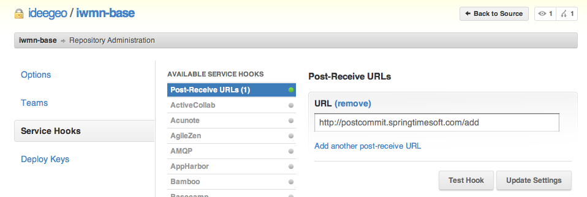
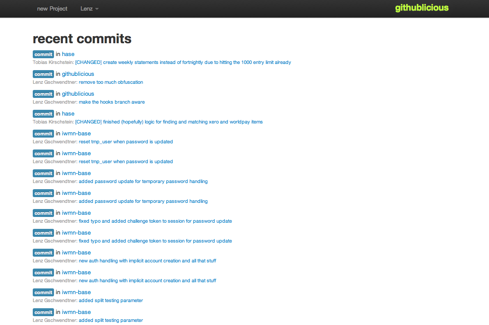

!SLIDE 
# Continous Integration #

for Perl projects

!SLIDE full-page

!SLIDE
# git #

!SLIDE
# use lots of topic branches #

!SLIDE commandline incremental

    @@@ sh
    $ git branch

    origin/HEAD -> origin/master
    origin/admin_tools
    origin/affiliate_tracking
    origin/bugfix
    origin/dyndns
    origin/handle_migrate
    origin/login_split_testing
    origin/master
    origin/oauth
    origin/user_prefs_handling
    origin/voucher_codes
    ...

!SLIDE
# master is king #

!SLIDE
# post commit hooks #

!SLIDE center

!SLIDE
# run anything on commit #

https://github.com/norbu09/githublicious

!SLIDE
# githublicious #

mojolicious app

extend it with plugins

currently supports: Jenkins

!SLIDE full-page

