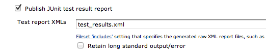
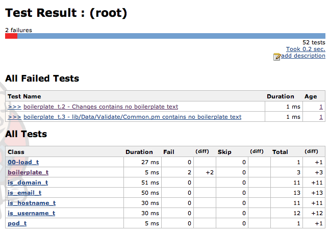
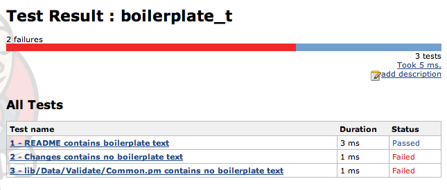
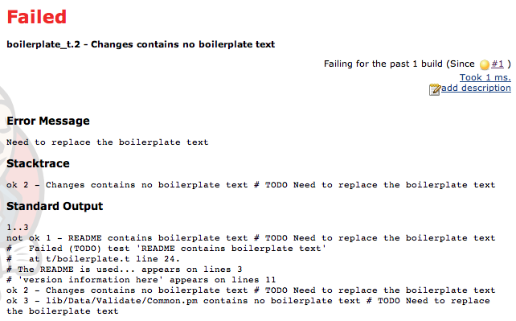
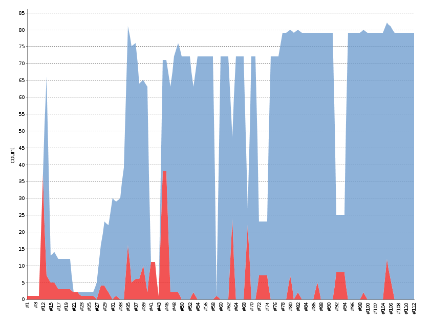
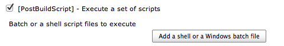

!SLIDE 
# Jenkins #

!SLIDE center

!SLIDE
# convince Jenkins to test Perl #

    TAP::Formatter::JUnit

!SLIDE
# the full glory #

    @@@ sh
    prove -r -Ilib --timer \
        --formatter=TAP::Formatter::JUnit \
        -l t > test_results.xml

!SLIDE
# Post-build Actions #

!SLIDE center

!SLIDE center

!SLIDE center

!SLIDE center

!SLIDE
# let the magic happen #

