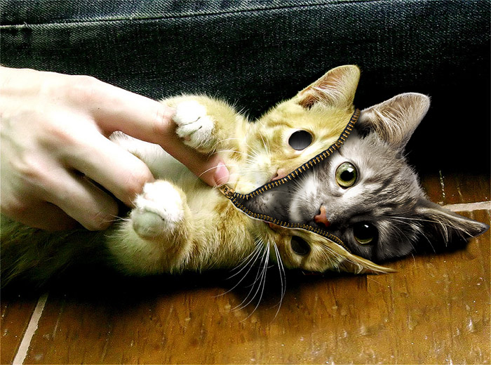

!SLIDE center
# 1 million ways to skin a cat #

!SLIDE
# Twitter Bootstrap #

an easy way to skin a cat

!SLIDE commandline incremental
# less #

    @@@ sh
    $ npm install
    $ ./build-css.sh

    Running JSHint on javascript...             Done
    Compiling LESS with Recess...               Done
    Compiling and minifying javascript...       Done

!SLIDE
# Themes #

* http://bootswatch.com/
* https://wrapbootstrap.com/
* http://www.bootstrapthemeroller.com/
* ... just google, many more

!SLIDE
# Template Layout #

default layout has:

* notification mechanism for info and errors
* menu handling for logged in/out users
* login form in menu bar
* CMS hacks

!SLIDE
# Templates for #

* login handling
* password reset handling
* admin editor templates
* user update page

!SLIDE
# Form handling #

    @@@ html
    <form class="form-horizontal well" method="post">
        <input type="hidden" 
               name="formfields" 
               value="username,name,company">
        <fieldset>
            <legend>Profile</legend>
            

                <label class="control-label" for="name">
                    Name
                </label>
                

                    <input type="text" 
                           class="span4" 
                           id="name" 
                           name="name" 
                           value="<%= $user->{name} %>">
                

            

    ...

!SLIDE
# ask Questions? #

now or later ⇾@norbu09
